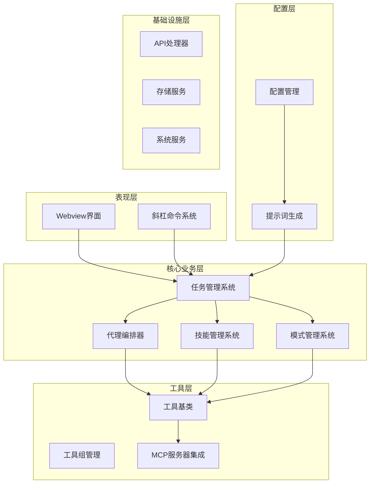
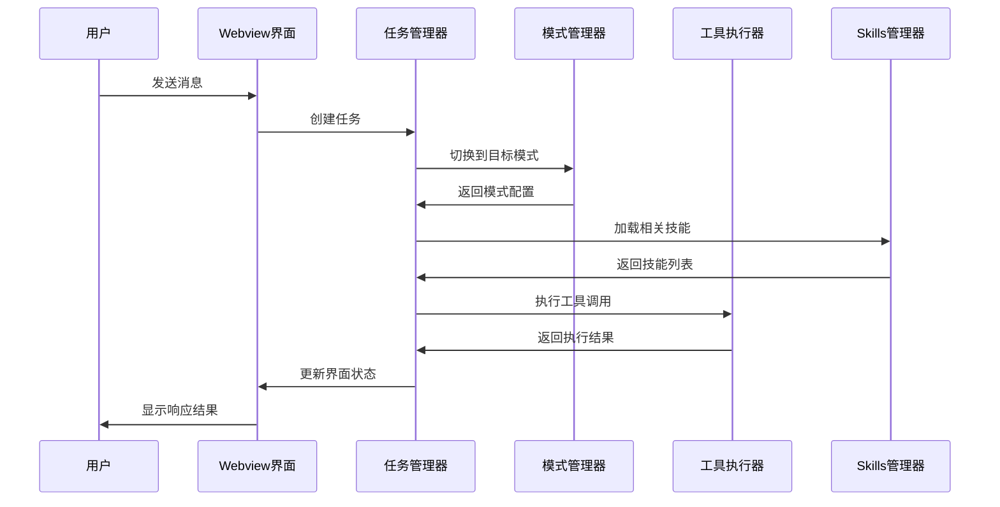
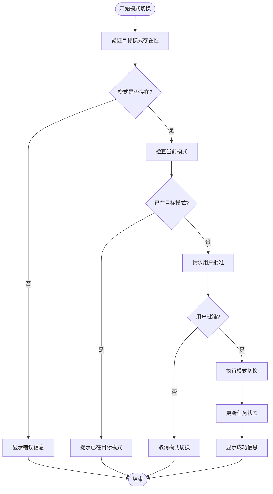
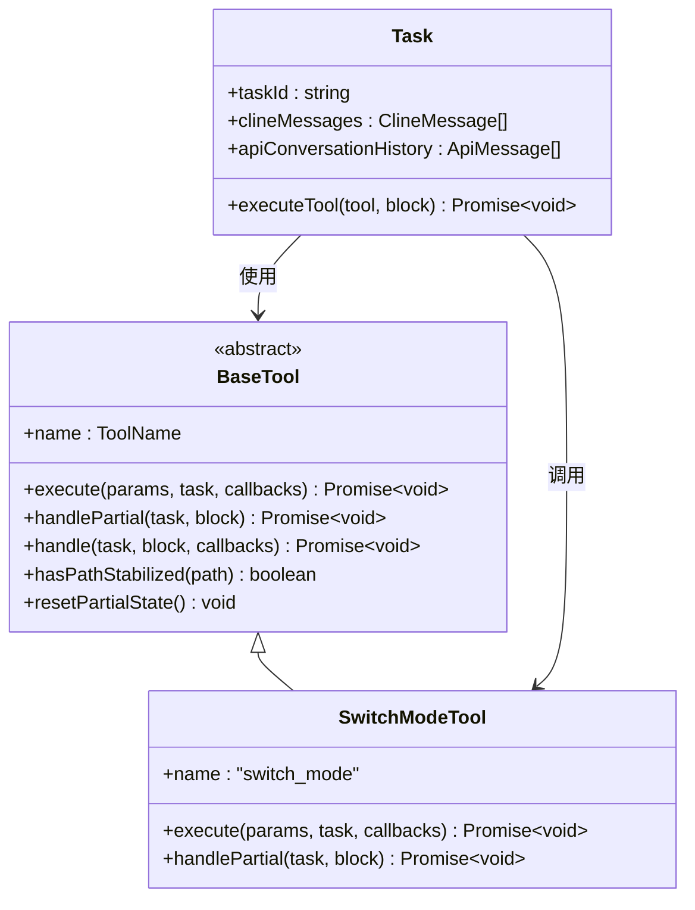
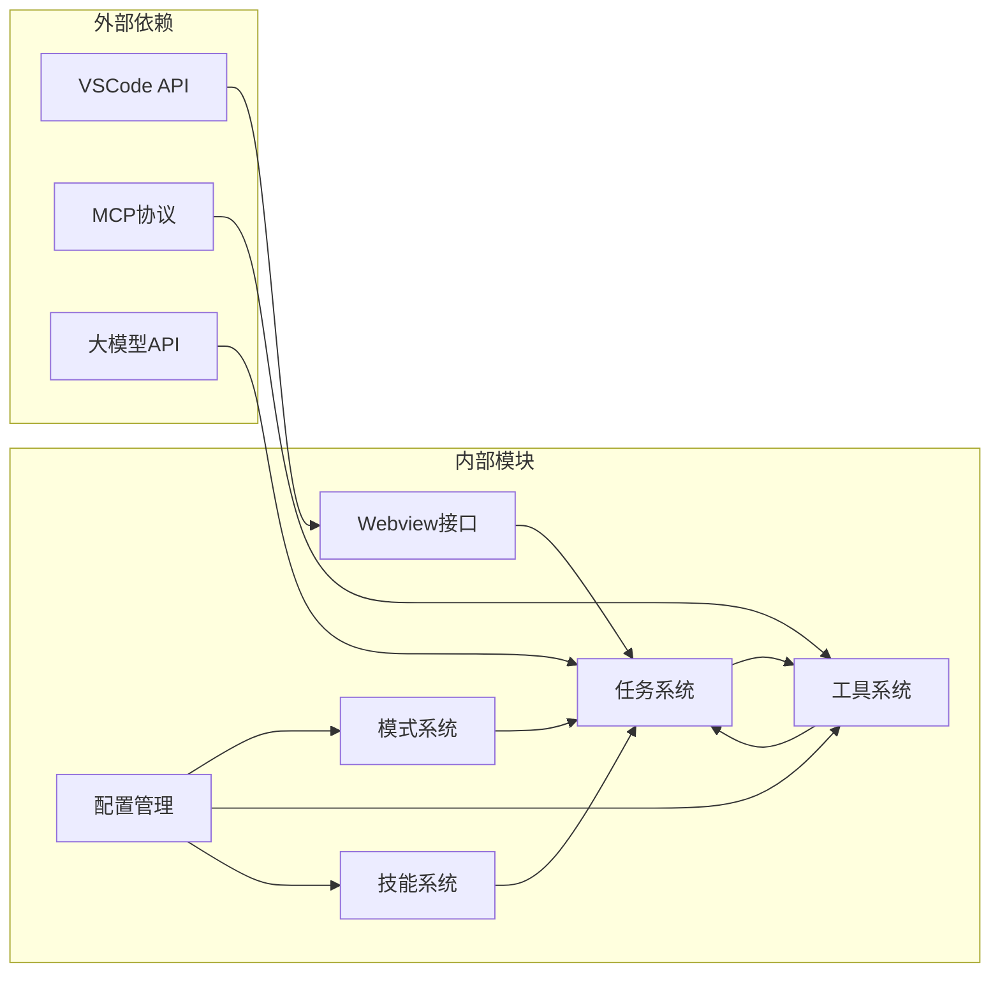

# 多模式工作流系统

<cite>
**本文档引用的文件**
- [CustomModesManager.ts](file://src/core/config/CustomModesManager.ts)
- [modes.ts](file://src/shared/modes.ts)
- [AgentOrchestrator.ts](file://src/core/agent/AgentOrchestrator.ts)
- [SwitchModeTool.ts](file://src/core/tools/SwitchModeTool.ts)
- [SkillsManager.ts](file://src/services/skills/SkillsManager.ts)
- [tools.ts](file://src/shared/tools.ts)
- [system.ts](file://src/core/prompts/system.ts)
- [built-in-commands.ts](file://src/services/command/built-in-commands.ts)
- [Task.ts](file://src/core/task/Task.ts)
- [generateSystemPrompt.ts](file://src/core/webview/generateSystemPrompt.ts)
- [BaseTool.ts](file://src/core/tools/BaseTool.ts)
- [modes.ts](file://src/core/prompts/sections/modes.ts)
- [skills.ts](file://src/core/prompts/sections/skills.ts)
</cite>

## 目录
1. [简介](#简介)
2. [项目结构](#项目结构)
3. [核心组件](#核心组件)
4. [架构概览](#架构概览)
5. [详细组件分析](#详细组件分析)
6. [依赖关系分析](#依赖关系分析)
7. [性能考虑](#性能考虑)
8. [故障排除指南](#故障排除指南)
9. [结论](#结论)

## 简介

多模式工作流系统是一个基于 VSCode 扩展的智能代码助手平台，支持多种专业模式（Cloud Agent、Architect、Code、Ask、Debug、Cangjie Dev、Orchestrator 等）的无缝切换和编排。该系统通过模块化的模式设计、灵活的工具组管理、智能化的提示词拼装机制，以及强大的 Skills 系统，为开发者提供从需求分析到代码实现的全栈式 AI 辅助开发体验。

系统的核心设计理念是"模式即能力"，每个模式都代表了一种特定的工作范式和工具集组合，用户可以根据任务类型选择最适合的模式，或通过自定义模式扩展系统功能。

## 项目结构

系统采用分层架构设计，主要分为以下几个层次：

**图表来源**
- [Task.ts:176-587](file://src/core/task/Task.ts#L176-L587)
- [AgentOrchestrator.ts:39-287](file://src/core/agent/AgentOrchestrator.ts#L39-L287)
- [SkillsManager.ts:22-729](file://src/services/skills/SkillsManager.ts#L22-L729)

**章节来源**
- [Task.ts:1-800](file://src/core/task/Task.ts#L1-L800)
- [AgentOrchestrator.ts:1-288](file://src/core/agent/AgentOrchestrator.ts#L1-L288)

## 核心组件

### 模式管理系统

模式管理系统是整个系统的核心，负责管理内置模式和自定义模式的生命周期。

**内置模式特性：**
- Cloud Agent：云端协作模式，支持分布式团队协作
- Architect：架构设计模式，专注于系统架构规划
- Code：代码编写模式，支持多语言代码生成和编辑
- Ask：问答模式，专门处理文档查询和知识问答
- Debug：调试模式，提供代码诊断和问题排查能力
- Cangjie Dev：Cangjie 语言开发模式，专为 Cangjie 编程语言优化
- Orchestrator：编排模式，用于复杂任务的协调和管理

**自定义模式功能：**
- 支持项目级和全局级模式配置
- YAML 格式配置文件管理
- 实时文件监听和热重载
- 模式优先级和覆盖机制

**章节来源**
- [modes.ts:45-91](file://src/shared/modes.ts#L45-L91)
- [CustomModesManager.ts:53-408](file://src/core/config/CustomModesManager.ts#L53-L408)

### 工具组管理系统

系统实现了灵活的工具组架构，将相关工具按功能分类管理：

**工具组分类：**
- read 组：文件读取、搜索、列表等读取操作
- edit 组：文件编辑、差异应用、补丁处理等编辑操作  
- command 组：命令执行、输出读取等命令行操作
- mcp 组：MCP 服务器工具集成
- modes 组：模式切换、新任务创建等模式相关操作

**工具权限控制：**
- 基础工具：所有模式默认可用
- 自定义工具：需要显式包含才能使用
- 权限验证：运行时检查工具调用权限

**章节来源**
- [tools.ts:302-331](file://src/shared/tools.ts#L302-L331)
- [tools.ts:266-271](file://src/shared/tools.ts#L266-L271)

### 提示词生成系统

提示词生成系统采用模块化设计，支持动态拼装和个性化定制：

**生成流程：**
1. 获取当前模式配置
2. 加载模式特定的规则和约束
3. 集成工具使用指南
4. 添加上下文信息和环境变量
5. 应用自定义指令和偏好设置

**动态内容：**
- 模式特定的角色定义
- 工具使用限制和最佳实践
- 项目特定的规则和约束
- 环境变量和系统信息

**章节来源**
- [system.ts:42-150](file://src/core/prompts/system.ts#L42-L150)
- [generateSystemPrompt.ts:12-70](file://src/core/webview/generateSystemPrompt.ts#L12-L70)

### Skills 系统

Skills 系统提供了强大的可扩展能力，支持技能的创建、管理和版本控制：

**技能管理特性：**
- 支持项目级和全局技能
- 模式特定的技能过滤
- 技能优先级和覆盖规则
- 实时文件监控和自动更新

**技能发现机制：**
- 多目录扫描策略
- 符号链接支持
- 前言元数据验证
- 模式关联性检查

**章节来源**
- [SkillsManager.ts:44-84](file://src/services/skills/SkillsManager.ts#L44-L84)
- [SkillsManager.ts:179-253](file://src/services/skills/SkillsManager.ts#L179-L253)

## 架构概览

系统采用事件驱动的异步架构，通过任务队列和状态管理确保各个组件的协调工作：

**图表来源**
- [Task.ts:577-586](file://src/core/task/Task.ts#L577-L586)
- [AgentOrchestrator.ts:116-176](file://src/core/agent/AgentOrchestrator.ts#L116-L176)

**章节来源**
- [Task.ts:176-800](file://src/core/task/Task.ts#L176-L800)
- [AgentOrchestrator.ts:1-288](file://src/core/agent/AgentOrchestrator.ts#L1-L288)

## 详细组件分析

### 模式切换机制

模式切换是系统的核心功能之一，通过 SwitchModeTool 实现安全的模式转换：

**图表来源**
- [SwitchModeTool.ts:18-72](file://src/core/tools/SwitchModeTool.ts#L18-L72)

**章节来源**
- [SwitchModeTool.ts:1-89](file://src/core/tools/SwitchModeTool.ts#L1-L89)
- [modes.ts:51-67](file://src/shared/modes.ts#L51-L67)

### 代理编排系统

AgentOrchestrator 提供了强大的并行任务执行能力：

**核心特性：**
- 并行任务调度和管理
- 共享上下文状态维护
- 依赖关系解析和执行
- 超时和错误处理机制

**执行流程：**
1. 解析任务规范和依赖关系
2. 分离独立任务和依赖任务
3. 并行执行独立任务
4. 顺序执行依赖任务
5. 收集和汇总执行结果

**章节来源**
- [AgentOrchestrator.ts:61-96](file://src/core/agent/AgentOrchestrator.ts#L61-L96)
- [AgentOrchestrator.ts:98-176](file://src/core/agent/AgentOrchestrator.ts#L98-L176)

### 工具执行框架

BaseTool 提供了统一的工具执行接口和生命周期管理：

**图表来源**
- [BaseTool.ts:30-167](file://src/core/tools/BaseTool.ts#L30-L167)
- [SwitchModeTool.ts:15-89](file://src/core/tools/SwitchModeTool.ts#L15-L89)

**章节来源**
- [BaseTool.ts:1-167](file://src/core/tools/BaseTool.ts#L1-L167)
- [Task.ts:334-401](file://src/core/task/Task.ts#L334-L401)

### 自定义模式开发

系统提供了完整的自定义模式开发工具链：

**开发流程：**
1. 创建模式配置文件（YAML 格式）
2. 定义工具组和权限
3. 编写模式特定的提示词
4. 配置规则文件和约束
5. 测试和部署

**配置选项：**
- 模式标识符和显示名称
- 角色定义和使用场景
- 工具组权限配置
- 自定义指令和规则
- 模式优先级和覆盖

**章节来源**
- [CustomModesManager.ts:410-469](file://src/core/config/CustomModesManager.ts#L410-L469)
- [CustomModesManager.ts:721-807](file://src/core/config/CustomModesManager.ts#L721-L807)

### 斜杠命令系统

内置的斜杠命令系统提供了丰富的预定义工作流：

**命令类型：**
- Spec Kit 初始化和工作流管理
- 项目特定的自动化脚本
- 开发辅助工具和模板
- 团队协作和文档生成

**实现机制：**
- 命令定义和描述管理
- 参数解析和验证
- 任务创建和执行
- 结果反馈和状态更新

**章节来源**
- [built-in-commands.ts:10-467](file://src/services/command/built-in-commands.ts#L10-L467)

## 依赖关系分析

系统采用松耦合的设计原则，通过清晰的接口定义实现组件间的解耦：

**图表来源**
- [system.ts:1-28](file://src/core/prompts/system.ts#L1-L28)
- [Task.ts:58-132](file://src/core/task/Task.ts#L58-L132)

**章节来源**
- [system.ts:1-199](file://src/core/prompts/system.ts#L1-L199)
- [Task.ts:1-800](file://src/core/task/Task.ts#L1-L800)

## 性能考虑

系统在多个层面进行了性能优化：

**内存管理：**
- 对象池和复用机制
- 弱引用避免内存泄漏
- 及时清理临时资源

**网络优化：**
- 请求合并和去重
- 智能缓存策略
- 连接池管理

**计算优化：**
- 异步处理和并发执行
- 延迟加载和按需初始化
- 计算结果缓存

## 故障排除指南

### 常见问题及解决方案

**模式切换失败：**
- 检查模式配置文件格式
- 验证工具权限设置
- 确认模式依赖关系

**工具执行错误：**
- 查看工具参数验证
- 检查文件路径和权限
- 验证外部依赖可用性

**提示词生成异常：**
- 检查模式配置完整性
- 验证规则文件语法
- 确认上下文信息正确性

**章节来源**
- [SwitchModeTool.ts:22-72](file://src/core/tools/SwitchModeTool.ts#L22-L72)
- [CustomModesManager.ts:153-187](file://src/core/config/CustomModesManager.ts#L153-L187)

## 结论

多模式工作流系统通过精心设计的架构和丰富的功能特性，为现代软件开发提供了强大的 AI 辅助能力。系统的核心优势在于：

1. **模块化设计**：清晰的分层架构和职责分离
2. **灵活性**：支持自定义模式和技能扩展
3. **可扩展性**：插件化的工具和集成机制
4. **易用性**：直观的界面和流畅的用户体验

该系统不仅满足了当前的开发需求，还为未来的功能扩展和技术演进奠定了坚实的基础。通过持续的优化和完善，系统将在 AI 辅助开发领域发挥越来越重要的作用。