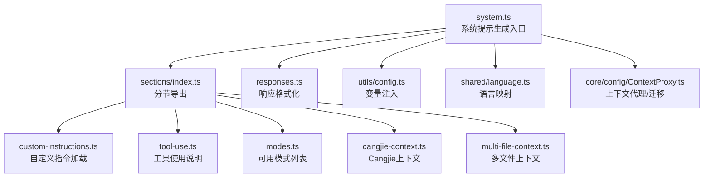
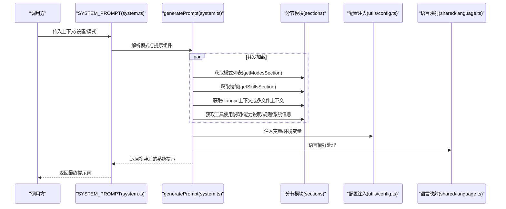
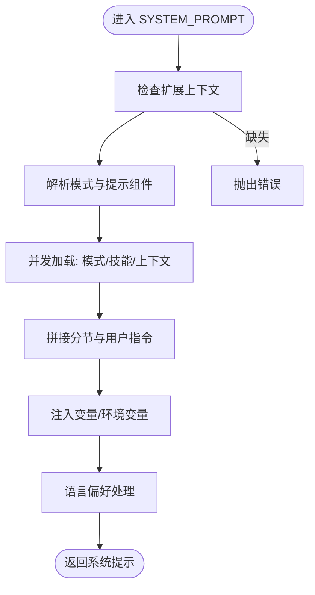
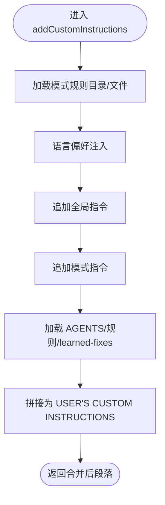
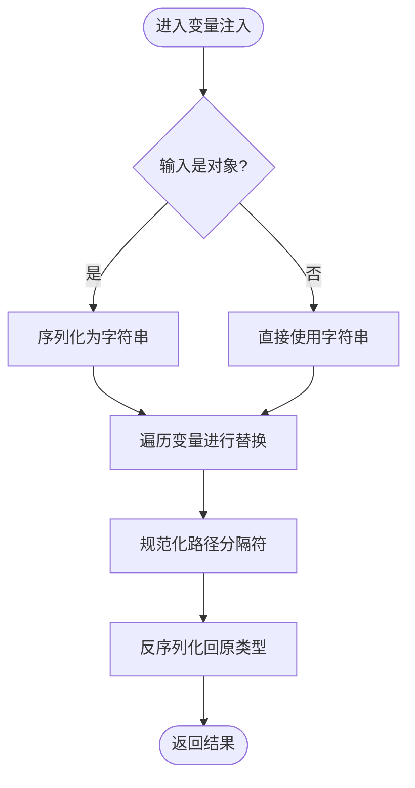
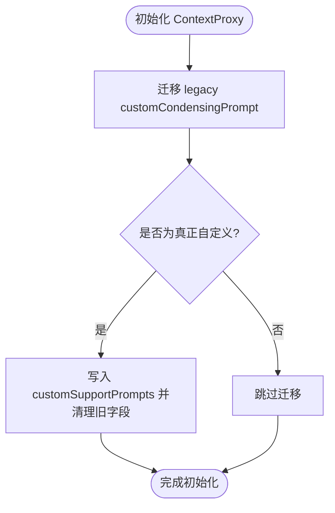
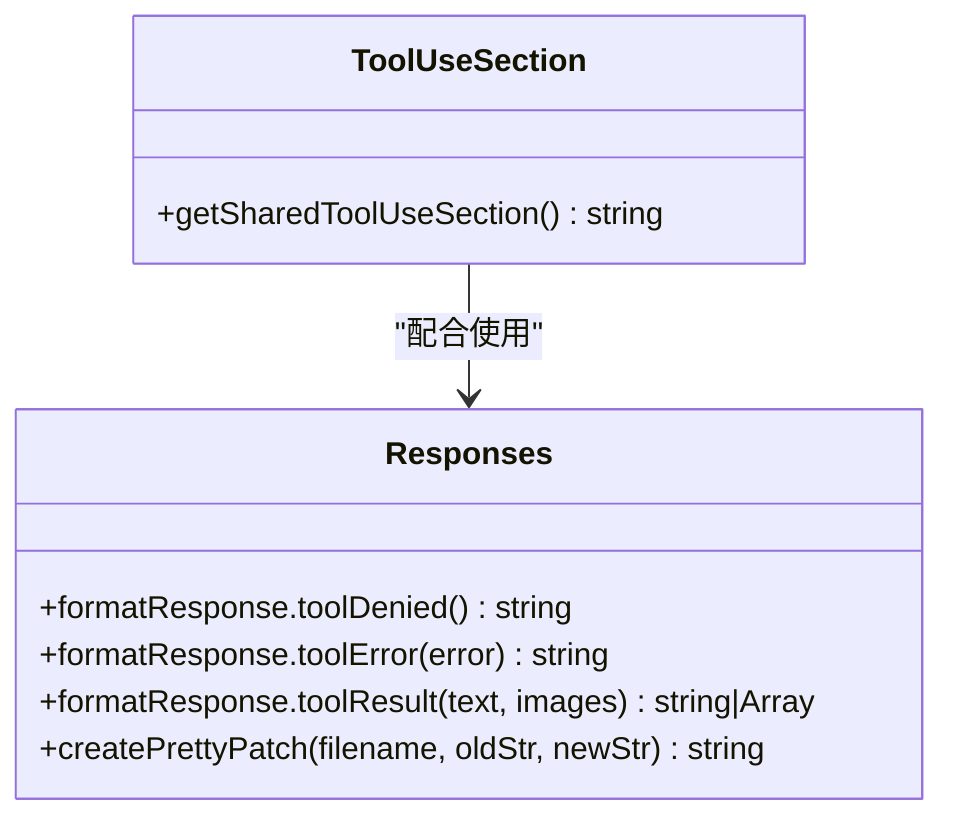
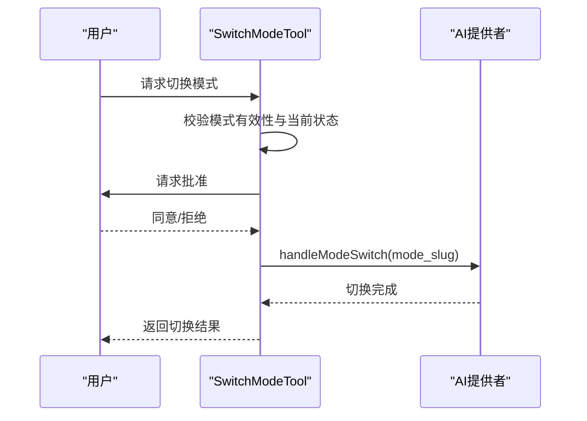
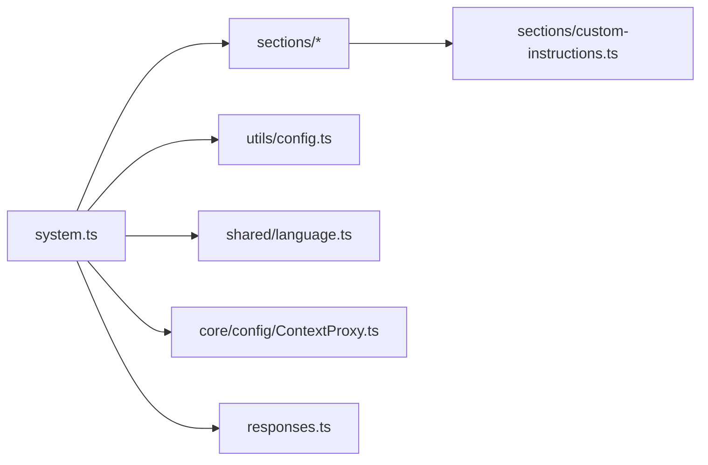

# 提示词系统

<cite>
**本文档引用的文件**
- [system.ts](file://src/core/prompts/system.ts)
- [types.ts](file://src/core/prompts/types.ts)
- [index.ts](file://src/core/prompts/sections/index.ts)
- [custom-instructions.ts](file://src/core/prompts/sections/custom-instructions.ts)
- [tool-use.ts](file://src/core/prompts/sections/tool-use.ts)
- [modes.ts](file://src/core/prompts/sections/modes.ts)
- [cangjie-context.ts](file://src/core/prompts/sections/cangjie-context.ts)
- [multi-file-context.ts](file://src/core/prompts/sections/multi-file-context.ts)
- [responses.ts](file://src/core/prompts/responses.ts)
- [config.ts](file://src/utils/config.ts)
- [language.ts](file://src/shared/language.ts)
- [ContextProxy.ts](file://src/core/config/ContextProxy.ts)
- [modes.spec.ts](file://src/shared/__tests__/modes.spec.ts)
- [get-prompt-component.spec.ts](file://src/core/prompts/__tests__/get-prompt-component.spec.ts)
- [modes-empty-prompt-component.spec.ts](file://src/shared/__tests__/modes-empty-prompt-component.spec.ts)
- [SwitchModeTool.ts](file://src/core/tools/SwitchModeTool.ts)
</cite>

## 目录
1. [简介](#简介)
2. [项目结构](#项目结构)
3. [核心组件](#核心组件)
4. [架构总览](#架构总览)
5. [详细组件分析](#详细组件分析)
6. [依赖分析](#依赖分析)
7. [性能考虑](#性能考虑)
8. [故障排查指南](#故障排查指南)
9. [结论](#结论)
10. [附录](#附录)

## 简介
本文件面向提示词系统的开发者与使用者，系统性阐述提示词的组织结构、拼装机制、版本与国际化支持、个性化定制能力，并提供开发指南与调试技巧。提示词系统由“系统提示词”“模式特定提示词”“工具提示词”“上下文提示词”等层次构成，通过统一的拼装流程生成最终的系统提示，用于指导模型行为与工具调用。

## 项目结构
提示词系统主要位于 core/prompts 目录下，包含系统提示生成器、分节模块、响应格式化与工具使用规范等。核心文件如下：
- 系统提示生成入口：system.ts
- 分节导出：sections/index.ts
- 自定义指令加载与合并：sections/custom-instructions.ts
- 工具使用说明：sections/tool-use.ts
- 模式列表：sections/modes.ts
- Cangjie 上下文：sections/cangjie-context.ts
- 多文件上下文：sections/multi-file-context.ts
- 响应格式化：responses.ts
- 配置变量注入：utils/config.ts
- 语言映射：shared/language.ts
- 上下文代理与迁移：core/config/ContextProxy.ts
- 测试用例：shared/__tests__ 与 core/prompts/__tests__

图表来源
- [system.ts:1-199](file://src/core/prompts/system.ts#L1-L199)
- [index.ts:1-11](file://src/core/prompts/sections/index.ts#L1-L11)
- [custom-instructions.ts:1-612](file://src/core/prompts/sections/custom-instructions.ts#L1-L612)
- [tool-use.ts:1-8](file://src/core/prompts/sections/tool-use.ts#L1-L8)
- [modes.ts:1-36](file://src/core/prompts/sections/modes.ts#L1-L36)
- [cangjie-context.ts:1-800](file://src/core/prompts/sections/cangjie-context.ts#L1-L800)
- [multi-file-context.ts:1-531](file://src/core/prompts/sections/multi-file-context.ts#L1-L531)
- [responses.ts:1-231](file://src/core/prompts/responses.ts#L1-L231)
- [config.ts:36-66](file://src/utils/config.ts#L36-L66)
- [language.ts:1-28](file://src/shared/language.ts#L1-L28)
- [ContextProxy.ts:97-143](file://src/core/config/ContextProxy.ts#L97-L143)

章节来源
- [system.ts:1-199](file://src/core/prompts/system.ts#L1-L199)
- [index.ts:1-11](file://src/core/prompts/sections/index.ts#L1-L11)

## 核心组件
- 系统提示生成器：负责组装系统提示词，整合角色定义、工具使用、能力说明、模式列表、技能、上下文与用户自定义指令。
- 分节模块：按主题拆分提示词段落，便于组合与复用。
- 自定义指令加载器：从全局与项目级规则目录、模式专用规则、AGENTS 文件、学习到的修复经验等来源聚合用户指令。
- 工具使用说明：统一的工具调用约束与最佳实践。
- 模式列表：列出可用模式及其适用场景描述。
- 上下文模块：根据语言与项目特性提供 Cangjie 或多文件上下文。
- 响应格式化：标准化工具执行结果与错误消息格式。
- 配置变量注入：支持占位符替换与环境变量注入。
- 语言映射：将 ISO 语言码映射为显示名称。
- 上下文代理：维护与迁移用户自定义提示配置。

章节来源
- [system.ts:42-150](file://src/core/prompts/system.ts#L42-L150)
- [custom-instructions.ts:435-570](file://src/core/prompts/sections/custom-instructions.ts#L435-L570)
- [tool-use.ts:1-8](file://src/core/prompts/sections/tool-use.ts#L1-L8)
- [modes.ts:8-35](file://src/core/prompts/sections/modes.ts#L8-L35)
- [cangjie-context.ts:1-800](file://src/core/prompts/sections/cangjie-context.ts#L1-L800)
- [multi-file-context.ts:481-520](file://src/core/prompts/sections/multi-file-context.ts#L481-L520)
- [responses.ts:7-231](file://src/core/prompts/responses.ts#L7-L231)
- [config.ts:36-66](file://src/utils/config.ts#L36-L66)
- [language.ts:1-28](file://src/shared/language.ts#L1-L28)
- [ContextProxy.ts:97-143](file://src/core/config/ContextProxy.ts#L97-L143)

## 架构总览
系统提示生成采用“分节拼装”的架构：先确定模式与角色，再并发获取模式、技能、上下文等分节，最后将用户自定义指令与系统信息合并，形成完整的系统提示。

图表来源
- [system.ts:152-198](file://src/core/prompts/system.ts#L152-L198)
- [system.ts:42-150](file://src/core/prompts/system.ts#L42-L150)
- [index.ts:1-11](file://src/core/prompts/sections/index.ts#L1-L11)
- [config.ts:36-66](file://src/utils/config.ts#L36-L66)
- [language.ts:1-28](file://src/shared/language.ts#L1-L28)

## 详细组件分析

### 组件A：系统提示生成器（SYSTEM_PROMPT）
- 职责：根据模式、自定义提示组件、设置与上下文，生成最终系统提示。
- 关键流程：
  - 解析模式与提示组件（过滤空对象）。
  - 并发获取模式列表与技能。
  - 选择 Cangjie 上下文或多文件上下文。
  - 拼接工具使用、能力、规则、系统信息与用户自定义指令。
  - 注入变量与语言偏好。
- 错误处理：对缺失上下文抛出明确异常；对空提示组件返回 undefined。

图表来源
- [system.ts:152-198](file://src/core/prompts/system.ts#L152-L198)
- [system.ts:42-150](file://src/core/prompts/system.ts#L42-L150)
- [config.ts:36-66](file://src/utils/config.ts#L36-L66)
- [language.ts:1-28](file://src/shared/language.ts#L1-L28)

章节来源
- [system.ts:29-40](file://src/core/prompts/system.ts#L29-L40)
- [system.ts:152-198](file://src/core/prompts/system.ts#L152-L198)
- [system.ts:42-150](file://src/core/prompts/system.ts#L42-L150)

### 组件B：自定义指令加载与合并（addCustomInstructions）
- 职责：从多个来源聚合用户指令，包括：
  - 全局与项目级规则目录（支持递归发现）。
  - 模式专用规则目录或兼容的旧文件。
  - AGENTS.md/AGENT.md（标准与本地覆盖）。
  - 通用规则文件与 .rooignore 指令。
  - 学习到的修复经验（learned-fixes）。
- 合并策略：按优先级与顺序拼接，支持语言偏好注入。

图表来源
- [custom-instructions.ts:435-570](file://src/core/prompts/sections/custom-instructions.ts#L435-L570)
- [custom-instructions.ts:206-239](file://src/core/prompts/sections/custom-instructions.ts#L206-L239)
- [custom-instructions.ts:406-433](file://src/core/prompts/sections/custom-instructions.ts#L406-L433)
- [custom-instructions.ts:343-380](file://src/core/prompts/sections/custom-instructions.ts#L343-L380)

章节来源
- [custom-instructions.ts:435-570](file://src/core/prompts/sections/custom-instructions.ts#L435-L570)
- [custom-instructions.ts:206-239](file://src/core/prompts/sections/custom-instructions.ts#L206-L239)
- [custom-instructions.ts:406-433](file://src/core/prompts/sections/custom-instructions.ts#L406-L433)
- [custom-instructions.ts:343-380](file://src/core/prompts/sections/custom-instructions.ts#L343-L380)

### 组件C：变量注入与路径规范化（injectVariables/injectEnv）
- 功能：支持字符串与对象的占位符替换，自动规范化路径分隔符，支持嵌套变量与默认值。
- 场景：在系统提示生成过程中注入环境变量、工作区路径等。

图表来源
- [config.ts:36-66](file://src/utils/config.ts#L36-L66)

章节来源
- [config.ts:36-66](file://src/utils/config.ts#L36-L66)

### 组件D：上下文代理与迁移（ContextProxy）
- 职责：维护用户自定义支持提示（condense/explain 等），迁移旧字段，避免将默认值固化。
- 迁移逻辑：仅当新位置无值且旧值非默认时才迁移，否则跳过以允许后续默认更新。

图表来源
- [ContextProxy.ts:97-143](file://src/core/config/ContextProxy.ts#L97-L143)

章节来源
- [ContextProxy.ts:97-143](file://src/core/config/ContextProxy.ts#L97-L143)

### 组件E：工具使用说明与响应格式化
- 工具使用说明：统一工具调用约束与最佳实践。
- 响应格式化：标准化工具执行结果、错误消息与图像块格式，支持补丁文本美化。

图表来源
- [tool-use.ts:1-8](file://src/core/prompts/sections/tool-use.ts#L1-L8)
- [responses.ts:7-231](file://src/core/prompts/responses.ts#L7-L231)

章节来源
- [tool-use.ts:1-8](file://src/core/prompts/sections/tool-use.ts#L1-L8)
- [responses.ts:7-231](file://src/core/prompts/responses.ts#L7-L231)

### 组件F：模式与切换
- 模式选择：基于模式配置与提示组件，决定角色定义与基础指令。
- 切换工具：支持在不同模式间切换，并进行权限确认与状态更新。

图表来源
- [SwitchModeTool.ts:38-88](file://src/core/tools/SwitchModeTool.ts#L38-L88)

章节来源
- [SwitchModeTool.ts:38-88](file://src/core/tools/SwitchModeTool.ts#L38-L88)

## 依赖分析
- 内聚性：分节模块高度内聚，职责单一；系统提示生成器作为编排者，耦合度适中。
- 耦合点：
  - system.ts 依赖分节模块与配置注入。
  - 自定义指令模块依赖规则目录扫描与 AGENTS 文件读取。
  - 上下文代理依赖全局状态与迁移逻辑。
- 循环依赖：未见循环依赖迹象。

图表来源
- [system.ts:13-27](file://src/core/prompts/system.ts#L13-L27)
- [index.ts:1-11](file://src/core/prompts/sections/index.ts#L1-L11)
- [config.ts:36-66](file://src/utils/config.ts#L36-L66)
- [language.ts:1-28](file://src/shared/language.ts#L1-L28)
- [custom-instructions.ts:1-612](file://src/core/prompts/sections/custom-instructions.ts#L1-L612)
- [ContextProxy.ts:97-143](file://src/core/config/ContextProxy.ts#L97-L143)
- [responses.ts:1-231](file://src/core/prompts/responses.ts#L1-L231)

章节来源
- [system.ts:13-27](file://src/core/prompts/system.ts#L13-L27)
- [index.ts:1-11](file://src/core/prompts/sections/index.ts#L1-L11)

## 性能考虑
- 并发加载：系统提示生成中对模式、技能、上下文等采用并发获取，减少等待时间。
- 路径规范化：在变量注入阶段统一路径分隔符，避免跨平台差异导致的重复处理。
- 上下文裁剪：多文件上下文与 Cangjie 上下文均设置了最大条目数与字符限制，防止提示词过长。
- 缓存与单例：Cangjie Corpus 语义索引采用单例缓存，避免重复初始化。

章节来源
- [system.ts:78-81](file://src/core/prompts/system.ts#L78-L81)
- [config.ts:150-218](file://src/utils/config.ts#L150-L218)
- [cangjie-context.ts:17-24](file://src/core/prompts/sections/cangjie-context.ts#L17-L24)
- [multi-file-context.ts:36-38](file://src/core/prompts/sections/multi-file-context.ts#L36-L38)

## 故障排查指南
- 空提示组件：当提示组件为空对象时，系统会返回 undefined，避免注入无效内容。
- 旧字段迁移：若自定义的 condense 提示与默认一致，不会迁移；只有真正自定义才会保留。
- 语言偏好：若语言码非法，回退为英文；确保语言映射正确。
- 变量注入：缺失的环境变量会输出警告并使用默认值或空字符串。
- 工具调用：若未使用工具，系统会返回错误提示并提醒使用工具。

章节来源
- [get-prompt-component.spec.ts:1-43](file://src/core/prompts/__tests__/get-prompt-component.spec.ts#L1-L43)
- [modes-empty-prompt-component.spec.ts:1-31](file://src/shared/__tests__/modes-empty-prompt-component.spec.ts#L1-L31)
- [ContextProxy.ts:113-143](file://src/core/config/ContextProxy.ts#L113-L143)
- [language.ts:21-28](file://src/shared/language.ts#L21-L28)
- [config.ts:78-101](file://src/utils/config.ts#L78-L101)
- [responses.ts:42-55](file://src/core/prompts/responses.ts#L42-L55)

## 结论
提示词系统通过清晰的层次划分与模块化设计，实现了可扩展、可定制、可维护的提示词拼装能力。其核心优势在于：
- 分层组织：系统提示、模式、工具、上下文与用户指令分离，便于独立演进。
- 并发优化：关键路径采用并发加载，提升生成效率。
- 可靠性保障：完善的空值过滤、旧字段迁移、变量注入与错误提示机制。
- 国际化与个性化：语言映射与自定义指令合并，满足多语言与多场景需求。

## 附录

### 开发指南：创建模式特定提示词
- 在自定义模式中提供 roleDefinition 与 customInstructions 字段，系统会将其与全局指令合并。
- 使用提示组件过滤空对象，避免注入无效内容。
- 若需要更细粒度控制，可在 .njust_ai/rules-${mode} 目录下放置规则文件，系统会自动加载。

章节来源
- [system.ts:29-40](file://src/core/prompts/system.ts#L29-L40)
- [custom-instructions.ts:455-492](file://src/core/prompts/sections/custom-instructions.ts#L455-L492)
- [modes.spec.ts:639-670](file://src/shared/__tests__/modes.spec.ts#L639-L670)

### 开发指南：实现动态内容生成
- 使用 addCustomInstructions 合并 AGENTS、规则与学习到的修复经验。
- 通过 enableSubfolderRules 与 useAgentRules 控制规则发现范围与 AGENTS 加载。
- 在系统提示中注入语言偏好与 rooIgnore 指令，增强个性化体验。

章节来源
- [custom-instructions.ts:435-570](file://src/core/prompts/sections/custom-instructions.ts#L435-L570)
- [custom-instructions.ts:448-449](file://src/core/prompts/sections/custom-instructions.ts#L448-L449)
- [custom-instructions.ts:528-535](file://src/core/prompts/sections/custom-instructions.ts#L528-L535)

### 开发指南：提示词版本管理与国际化
- 版本管理：通过 ContextProxy 对旧字段进行迁移，避免默认值固化，保证后续更新生效。
- 国际化：使用 language 映射将 ISO 代码转换为显示名称；在 addCustomInstructions 中注入语言偏好。

章节来源
- [ContextProxy.ts:97-143](file://src/core/config/ContextProxy.ts#L97-L143)
- [language.ts:7-11](file://src/shared/language.ts#L7-L11)
- [custom-instructions.ts:494-500](file://src/core/prompts/sections/custom-instructions.ts#L494-L500)

### 调试与测试技巧
- 单元测试：利用 getPromptComponent 与 modes 的测试用例验证空组件与空对象行为。
- 模式测试：通过 getFullModeDetails 测试自定义模式覆盖与指令合并。
- 变量注入测试：参考 config.spec 中的环境变量注入与路径规范化用例。

章节来源
- [get-prompt-component.spec.ts:1-43](file://src/core/prompts/__tests__/get-prompt-component.spec.ts#L1-L43)
- [modes-empty-prompt-component.spec.ts:1-31](file://src/shared/__tests__/modes-empty-prompt-component.spec.ts#L1-L31)
- [modes.spec.ts:639-689](file://src/shared/__tests__/modes.spec.ts#L639-L689)
- [config.spec.ts:134-243](file://src/utils/__tests__/config.spec.ts#L134-L243)