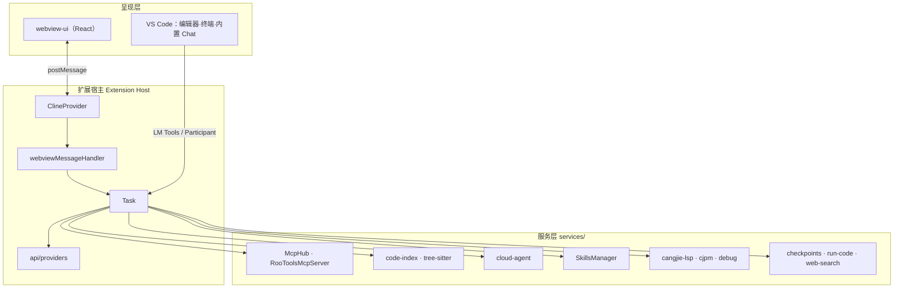
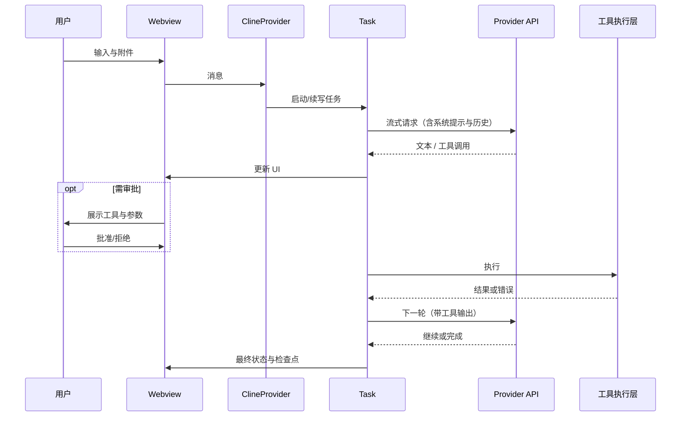
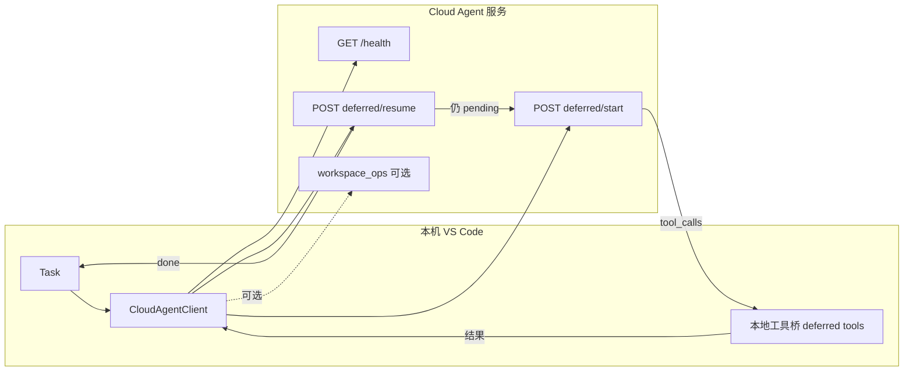
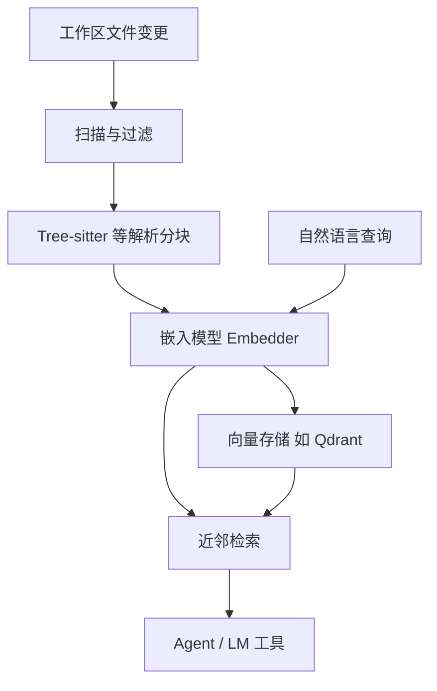
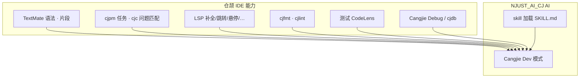

# NJUST_AI_CJ

> 基于 [NJUST_AI_CJ](https://github.com/NJUST-AI/NJUST_AI_CJ) 定制的 AI 编程助手 VS Code 扩展，面向 NJUST 内部使用。

## 项目概述

NJUST_AI_CJ 是一个运行在 VS Code / Cursor 中的 AI 编程助手扩展。它通过侧栏 Webview 与可选的编辑器标签页进行对话，理解工作区代码、生成与修改文件、在集成终端执行命令，并支持多种工作模式与模型提供商。扩展还内建**仓颉（Cangjie）语言**工具链集成（LSP、`cjpm` 任务、调试与静态检查等），便于在同一环境中进行仓颉开发与 AI 协作。

本项目基于 NJUST_AI_CJ 上游进行定制：**移除了**与账号、组织、市集浏览相关的上游云服务与 Marketplace 流程；**保留并扩展**了本地/自建服务对接能力。其中 **Cloud Agent** 通过可配置的 REST 服务端运行代理任务（健康检查、`/v1/run` 或延期协议下的 `deferred/start` 与 `deferred/resume`），与“登录云账号、同步任务到商业云产品”不是同一套能力。本地开发与协议细节见仓库根目录的 `AGENTS.md`。

## 架构与交互图示

下列示意图用于与文字说明对照阅读。GitHub、VS Code 内置 Markdown 预览及多数文档站点支持 **Mermaid** 渲染；若你的阅读器不渲染图表，可直接对照图中的节点名称在仓库中搜索对应模块。

### 界面布局（侧栏 + 编辑区）

扩展主界面挂在活动栏，与编辑器、终端、问题面板等并列，形成「左对话、右代码」的常见工作布局：

```
┌──────────────────────────────────────────────────────────────────────┐
│  VS Code / Cursor 窗口                                                │
│  ┌──┐ ┌────────────────────────────────┬─────────────────────────────┐ │
│  │≡ │ │  资源管理器 / 搜索 / …          │  编辑器（源码、Diff）        │ │
│  │█ │ │                                │                             │ │
│  │… │ │                                │  终端 / 调试 / 问题         │ │
│  └──┘ ├────────────────────────────────┴─────────────────────────────┤ │
│       │  NJUST_AI_CJ：对话 · 模式 · 工具审批 · 历史 · 设置（Webview）   │ │
│       └──────────────────────────────────────────────────────────────┘ │
└──────────────────────────────────────────────────────────────────────┘
        █ = 本扩展活动栏入口；侧栏可「在编辑器中打开」变为独立标签页
```

### 运行时逻辑分层

从进程边界看，**Webview 与扩展宿主分离**；宿主内 **ClineProvider / Task** 串联 UI、模型与各类服务：



### 本地模型模式：一轮对话与工具闭环

用户输入经 Webview 进入 **Task**，模型返回工具调用时在 UI 上审批（若未自动批准），执行结果再作为消息喂回模型，直至结束或中断：



### Cloud Agent：延期协议循环（概念）

开启 `deferredProtocol` 时，**推理在服务端**，**读写与命令在本地**；多轮 `start` / `resume` 直到状态为完成或达上限：



### 代码索引：从文件到语义检索

索引与对话可配置**不同嵌入端点**；向量库命中后供 **codebase_search** 与 **roo_codebaseSearch** 使用：



### 仓颉：语言支持与 AI 模式的关系

**.cj 文件**由语言包与 LSP 提供传统 IDE 能力；**Cangjie Dev 模式**约束 Agent 工具范围与提示词，可与 **Skills** 中的仓颉文档联动：



## 与上游 NJUST_AI_CJ 的主要差异

| 模块 | 状态 | 说明 |
| --- | --- | --- |
| 上游账号/组织/市集云 | 已移除 | 登录、组织管理、市集安装 MCP/Mode 等外部闭环 |
| Marketplace | 已移除 | 远程市集浏览与安装；MCP 改由界面与配置本地管理 |
| Telemetry | 已简化 | 保留类型与结构，弱化或去除远程上报逻辑 |
| Cloud Agent（REST） | 保留 | 连接自建或内网服务；`njust-ai-cj.cloudAgent.*` 配置服务端 URL、API Key、延期协议、远程 workspace 写操作与编译反馈循环等 |
| 仓颉语言与工具链 | 定制增强 | 语法/片段、`cjpm` 任务、`cjc` 问题匹配、LSP、格式化/诊断、测试 CodeLens、调试适配 |
| MCP 配置 | 保留 | MCP 服务器管理、Hub、与对话中的工具调用 |
| Modes 系统 | 保留 | 内置含 **Cloud Agent**、Architect、Code、Ask、Debug、**Cangjie Dev**、**Orchestrator** 等，支持自定义模式与项目级 `.roomodes` |
| Skills | 保留 | 从工作区（如 `.njust_ai/skills`）发现 `SKILL.md` 并在任务中作为工具使用 |
| 代码索引 | 保留 | Codebase Indexing 与向量语义检索 |
| Checkpoints | 保留 | 任务级快照与回滚 |

## 插件功能模块

以下按**运行时架构**说明各模块职责及相互关系（实现主要分布在 `src/core/`、`src/services/`、`webview-ui/`；类型在 `packages/types/`）。**整体分层、任务时序、Cloud Agent 与索引流水线**已在上文「架构与交互图示」中用图概括，本节按模块展开细节，可与图示对照阅读。

### 1. UI 与交互（Webview）

- **侧栏视图**：活动栏中的 Webview 主界面（`ClineProvider`），承载对话流、模式切换、模型与 API 配置入口、MCP 与索引等设置的入口。
- **独立标签页**：可将同一套界面弹出到编辑器区域，便于宽屏对照代码；标题栏与侧栏共用一套导航命令（新任务、运行代码、历史、设置等）。
- **设置页**：扩展内设置与 VS Code `settings.json` 中的 `njust-ai-cj.*` 联动；复杂项（API 密钥、MCP、索引模型等）在 Webview 中集中编辑。开发时注意：设置表单应绑定本地缓冲状态，保存后再写回全局状态，避免与 `ContextProxy` 竞态（见 `AGENTS.md` 中 Settings View 约定）。
- **前端工程**：`webview-ui/` 为 React 应用，通过消息与扩展宿主双向通信，负责渲染消息列表、工具调用审批 UI、diff 预览、历史任务等。

### 2. 任务核心与消息管线

- **Task**：单次用户请求的完整生命周期（多轮模型往返、工具执行、中断与恢复）。负责拼装系统提示、挂载模式与 Skills、调度工具、写入检查点、以及 **Cloud Agent** 模式下的 HTTP 循环（`Task.initiateCloudAgentLoop` 等）。
- **ClineProvider**：Webview 宿主、全局状态与 Task 的粘合层；注册命令、转发 Webview 消息、维护当前任务与历史。
- **消息处理**：`webviewMessageHandler` 等将 UI 操作映射为状态更新（如切换模式、更新终端行为、同步 `cloudAgent.serverUrl` 等到 VS Code 配置）。
- **助手消息解析**：`presentAssistantMessage` 等将模型输出解析为文本、推理块、工具调用块并驱动 UI 与执行器。
- **任务持久化**：`task-persistence` 等将会话与任务元数据落盘，支撑历史列表与恢复。

### 3. 模式（Modes）与提示词

- **内置模式**（见 `packages/types` 中 `DEFAULT_MODES`）：**Cloud Agent**（远端推理 + 本地工具）、**Architect**（规格/计划/任务拆解，可与 `.specify/`、`/plans/` 工作流配合）、**Code**、**Ask**、**Debug**、**Cangjie Dev**、**Orchestrator**（通过子任务工具在多模式间编排）。
- **自定义模式**：用户可在全局或项目中定义模式；项目根目录下的 **`.roomodes`** 文件（YAML）可覆盖/追加模式，与设置中的自定义模式合并（项目优先）。
- **工具组（Tool Groups）**：每种模式绑定可读/可写/终端/MCP 等工具子集，控制 Agent 能力边界。
- **提示词拼装**：`core/prompts/` 下按模式、工具、用户规则、工作区规则（如 `AGENTS.md`、`.njust_ai/rules-*`）组合系统提示；内置 **斜杠/命令** 定义在 `services/command/`（如初始化项目说明、生成规则文件等）。

### 4. AI 模型接入（Providers）

- **统一抽象**：`src/api/providers/` 下按厂商实现流式补全、工具调用、错误与超时处理；`fetchers/` 负责拉取模型列表与端点缓存。
- **常见接入方式**：OpenAI 兼容、Anthropic、Gemini、OpenRouter、Ollama、LM Studio、DeepSeek、Qwen、Bedrock、**VS Code Language Model API**（使用编辑器自带模型管线）、以及 Router / LiteLLM / 国内豆包、GLM 等（以仓库内实际 provider 文件为准）。
- **索引专用嵌入**：代码索引模块可使用独立的嵌入模型与端点（与对话模型分开配置），见 `services/code-index/embedders/`。

### 5. 原生工具与自动批准

- **内置工具**（`core/prompts/tools/`、`core/tools/`）：读文件、写文件/打补丁、列目录、工作区搜索、执行终端命令、浏览器相关（若启用）、**代码库语义搜索**（依赖索引）、**web_search**（需配置）、**skill**（加载 Skill 文档）、子任务/模式切换、待办列表更新等。
- **自动批准**：`core/auto-approval/` 与设置中的始终允许列表配合，减少重复点击；也可用命令 **Ctrl+Alt+A**（macOS **Cmd+Alt+A**）快速切换策略。
- **终端执行安全**：`njust-ai-cj.allowedCommands`、`deniedCommands`、超时与超时白名单等限制危险命令与长时间挂起；`preventCompletionWithOpenTodos` 等用于流程控制。

### 6. MCP 子系统

- **McpHub**：启动/停止 MCP 进程、管理多服务器配置、将 MCP 工具暴露给当前任务；支持在设置中总开关 `mcpEnabled`。
- **RooToolsMcpServer**（`services/mcp-server/`）：扩展内嵌的 MCP 服务，把部分 Roo 能力以 MCP 工具形式提供给外部客户端或同一工作流中的其他组件。
- **与 Cloud Agent 的关系**：延期协议下服务端也可下发与 MCP 同构的工具调用名（如 `read_file`、`write_file`），由扩展在本地执行并回传结果（见 `AGENTS.md`）。

### 7. Cloud Agent 子系统

- **客户端**：`services/cloud-agent/CloudAgentClient.ts` 负责 **GET /health**、**POST /v1/run**，以及在 `njust-ai-cj.cloudAgent.deferredProtocol` 开启时的 **deferred/start** 与 **deferred/resume** 循环。
- **本地工具桥**：`executeDeferredToolCall` 等将服务端工具名映射到扩展内真实读写、终端、搜索等实现。
- **Workspace 操作**：`parseWorkspaceOps` / `applyCloudWorkspaceOps` 解析响应中的 `workspace_ops`（`write_file` / `apply_diff`），受 `applyRemoteWorkspaceOps` 与 `confirmRemoteWorkspaceOps` 控制。
- **编译反馈**：可选 **POST /v1/compile** 与 `compileLoop` 配置，在应用变更后让服务端编译并将错误反馈给代理迭代修复。
- **鉴权**：首次激活生成 **device token** 写入全局状态并同步到 `cloudAgent.deviceToken`；请求可带 **X-API-Key**（`cloudAgent.apiKey` 或环境变量）。联调可用 `src/test-cloud-agent-mock.mjs`（详见 `AGENTS.md`）。

### 8. 代码索引与语义搜索

- **管理器**：`services/code-index/manager.ts` 按工作区文件夹维护索引生命周期。
- **流水线**：扫描文件 → 解析分块（含 **Tree-sitter** `services/tree-sitter/` 多语言解析）→ 调用嵌入模型 → 写入向量存储（如 **Qdrant** 客户端 `vector-store/qdrant-client.ts`）。
- **搜索服务**：自然语言查询命中向量库，供 Agent 工具 **codebase_search** 与 VS Code 注册的 **roo_codebaseSearch** 使用。
- **缓存**：`cache-manager` 等减少重复嵌入与重建成本。

### 9. Skills 子系统

- **SkillsManager**（`services/skills/`）：在全局与用户项目中扫描 **`SKILL.md`**（如 `.njust_ai/skills/`、按模式分目录的 `skills-{mode}/` 等约定），解析 frontmatter（名称、描述、`modeSlugs` 等）。
- **解析与去重**：同名 Skill 按来源与模式解析覆盖顺序（项目优先于全局等）。
- **运行时**：模型通过 **skill** 工具按名称加载正文，用于仓颉文档、算法模板等长上下文按需注入。

### 10. 仓颉（Cangjie）语言工作台

- **语言包**：`src/package.json` 注册 `cangjie` 语言、**TextMate** 语法、片段、`cjpm` **taskDefinitions**、**cjc** **problemMatchers**。
- **LSP**：`CangjieLspClient` 连接仓颉语言服务；提供补全、跳转定义、查找引用、重命名、悬停、折叠、文档符号等；**状态栏**显示连接与错误提示。
- **格式化与诊断**：可选集成 **cjfmt**、**cjlint**（路径与开关见 `cangjieTools.*`、`cangjieLsp.*`）。
- **cjpm**：`CjpmTaskProvider` 将 **Tasks: Run Task** 与 `cjpm` 子命令对接；命令面板 **Cangjie** 分类提供 build/run/test/check/clean、重启 LSP、运行或调试测试等。
- **测试**：`CangjieTestCodeLensProvider` 在测试上提供运行/调试 CodeLens。
- **调试**：**Cangjie Debug** 调试类型与 `CangjieDebugAdapterFactory` 对接 **cjdb**；启动配置片段带 **preLaunchTask** `cjpm: build`。
- **其它编辑体验**：代码动作、宏 CodeLens/悬停、符号索引辅助、SDK 安装引导（`CangjieSdkSetup`）等。
- **与 AI 协同**：**Cangjie Dev** 模式为仓颉专项提示词与工具范围；可配合 Skills 中的仓颉文档技能。

### 11. 编辑器与 Diff 集成

- **上下文菜单**：编辑器内 **加入上下文**、**解释**、**改进**；另有 **修复** 等命令可在命令面板搜索扩展名使用。
- **Diff 视图**：对模型提议的修改使用专用 diff 方案（`DIFF_VIEW_URI_SCHEME` 等），便于逐块接受或拒绝。
- **Code Actions**：`activate/CodeActionProvider` 等与灯泡菜单集成，将快捷修复接入工作流。

### 12. 终端子系统

- **TerminalRegistry**：统一管理 Agent 使用的终端实例，避免与用户终端冲突并跟踪输出。
- **终端上下文菜单**：**加入上下文**、**修复命令**、**解释命令**。
- **Shell 适配**：消息管线中可配置 PowerShell/Zsh 等行为（延迟、提示符相关选项等），减少输出解析误判。

### 13. Checkpoints（检查点）

- **ShadowCheckpointService**（`services/checkpoints/`、`core/checkpoints/`）：在任务关键步骤创建影子副本，支持用户回滚到某次工具应用前的文件状态；含排除规则避免索引目录或构建产物被误拷贝。

### 14. 联网搜索

- **WebSearchProvider**（`services/web-search/`）：在设置中开启 `enableWebSearch` 并配置 **Tavily** API Key 后，Agent 可调用网络搜索工具拉取最新网页摘要（适合文档/API 变更查询）。

### 15. VS Code 内置 AI 集成（Chat / LM API）

- **Chat Participant**：`chat/ChatParticipantHandler` 注册 **Roo Agent**（`@roo`），子命令 **code / architect / ask / debug / plan** 等，与内置聊天 UI 协作。
- **Language Model 工具**：`chat/registerLMTools` 注册 **roo_readFile、roo_editFile、roo_executeCommand、roo_searchFiles、roo_listFiles、roo_codebaseSearch**，供支持工具调用的内置模型使用。
- **状态同步**：`ChatStateSync` 在适当时机与扩展侧状态对齐（避免双轨配置脱节）。

### 16. 配置、迁移与国际化

- **ContextProxy**：扩展内设置的单一可信来源，与 `vscode.workspace.getConfiguration('njust-ai-cj')` 中的部分键（如 Cloud Agent URL）协同。
- **迁移与导入**：`migrateSettings`、`importSettings` 命令与自动导入逻辑兼容旧键名或团队分发场景。
- **自定义存储路径**：可将任务/状态存放到用户指定目录。
- **i18n**：`src/i18n/` 与 `webview-ui` 内文案支持多语言，随 VS Code 显示语言或用户选择切换。

### 17. 对外 API 与杂项

- **Programmatic API**：`extension/api.ts` 暴露 **NJUST_AI_CJAPI**（创建任务、查询状态、事件订阅等），可选 **IPC** 通道供外部进程集成（高级用法）。
- **运行代码**：`services/run-code/runCode.ts` 与侧栏/快捷键 **Ctrl+F5**（macOS **Cmd+F5**）联动，按当前文件类型选择运行方式。
- **URI 回调**：`activate/handleUri` 处理 **OpenRouter**、**Requesty** 等 OAuth 回调（`vscode://` 协议），将授权码交回扩展以完成提供商连接。
- **开发期网络**：调试模式下可初始化 **HTTP(S) 代理**（`initializeNetworkProxy`），便于企业环境抓包。
- **环境变量**：扩展安装目录下可选 **`.env`**，在 `activate` 阶段由 dotenvx 加载，便于开发时注入密钥而不写入用户设置。

## 本地开发

### 环境要求

- Node.js 20.19.2
- pnpm 10.8.1

### 安装与运行

1. 克隆仓库：

```sh
git clone <repo-url>
cd NJUST_AI_CJ
```

2. 安装依赖：

```sh
pnpm install
```

3. 启动开发模式：

在 VS Code 中按 `F5` 启动调试，会打开一个加载了 NJUST_AI_CJ 扩展的新窗口。Webview 和核心扩展的修改都会自动热重载。

### 构建 VSIX

```sh
pnpm vsix
```

生成的 `.vsix` 文件位于 `bin/` 目录下，可通过以下命令安装：

```sh
code --install-extension bin/njust-ai-cj-<version>.vsix
```

或使用自动化安装脚本：

```sh
pnpm install:vsix
```

## 项目结构

```
├── src/                         # VS Code 扩展主体
│   ├── api/providers/           # 各 AI 模型提供商与端点适配
│   ├── chat/                    # VS Code Chat Participant、LM 工具注册等
│   ├── core/                    # 任务（Task）、ClineProvider、工具与消息处理
│   ├── services/                # 代码索引、MCP、Skills、仓颉 LSP、Cloud Agent 等
│   ├── extension/               # 对外 API 等
│   └── i18n/                    # 国际化（扩展端）
├── webview-ui/                  # React 侧栏 / Webview 前端
│   ├── src/components/
│   └── src/context/
├── packages/
│   ├── types/                   # 共享类型
│   └── telemetry/               # Telemetry（已简化）
├── AGENTS.md                    # Cloud Agent 与协作开发约定
└── LICENSE
```

## 许可证

[Apache 2.0](./LICENSE)
